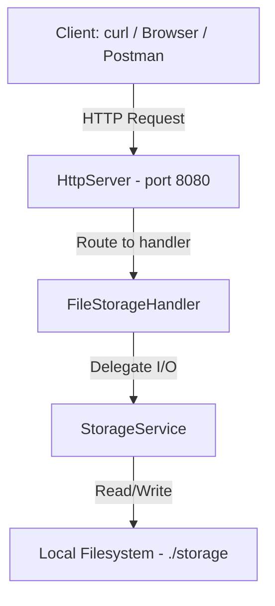

# Remote File Storage — REST API Architecture Plan

## Overview

Implement a remote file storage service exposing a REST API over HTTP using Java's built-in `com.sun.net.httpserver.HttpServer`. No external dependencies or build tools required.

## Technology Stack

- **Language**: Java (JDK 17+)
- **HTTP Server**: `com.sun.net.httpserver.HttpServer` (built into JDK)
- **Storage**: Local filesystem (directory `./storage` as virtual root)
- **No external dependencies** — works with plain IntelliJ project

## Architecture



## File Structure

```
src/
  Main.java                 — Entry point, starts HttpServer
  FileStorageHandler.java   — Handles HTTP requests, parses method/path/headers
  StorageService.java       — Filesystem operations: read, write, delete, copy, list
```

## REST API Specification

### URL Scheme

The URL path maps to a virtual file path in the storage:

```
http://localhost:8080/path/to/file.txt  →  ./storage/path/to/file.txt
http://localhost:8080/path/to/dir/      →  ./storage/path/to/dir/
```

### Endpoints

| HTTP Method | Path | Description | Success Code | Error Codes |
|-------------|------|-------------|--------------|-------------|
| **GET** | `/path/to/file.txt` | Download file content | 200 | 404, 500 |
| **GET** | `/path/to/dir/` | List directory contents as JSON | 200 | 404, 500 |
| **PUT** | `/path/to/file.txt` | Upload file, overwrite if exists | 201 / 204 | 400, 500 |
| **PUT** | `/path/to/file.txt` + header `X-Copy-From: /src/path` | Copy file from source | 201 / 204 | 400, 404, 500 |
| **HEAD** | `/path/to/file.txt` | Get file metadata headers only | 200 | 404, 500 |
| **DELETE** | `/path/to/file.txt` | Delete file | 204 | 404, 500 |
| **DELETE** | `/path/to/dir/` | Delete directory recursively | 204 | 404, 500 |

### HTTP Status Codes

| Code | Meaning | Usage |
|------|---------|-------|
| 200 | OK | Successful GET, HEAD |
| 201 | Created | New file created via PUT |
| 204 | No Content | File overwritten via PUT, successful DELETE |
| 400 | Bad Request | Invalid path, missing body |
| 404 | Not Found | File/directory does not exist |
| 405 | Method Not Allowed | Unsupported HTTP method |
| 500 | Internal Server Error | Unexpected server errors |

### Response Headers

| Header | Methods | Description |
|--------|---------|-------------|
| `Content-Type` | GET | `application/octet-stream` for files, `application/json` for directory listings |
| `Content-Length` | GET, HEAD | File size in bytes |
| `Last-Modified` | GET, HEAD | File last modified date (RFC 1123) |
| `Content-Disposition` | GET | `attachment; filename="..."` for file downloads |

### Directory Listing JSON Format

```json
{
  "path": "/path/to/dir",
  "files": [
    {
      "name": "file1.txt",
      "type": "file",
      "size": 1024,
      "lastModified": "2026-05-04T15:30:00Z"
    },
    {
      "name": "subdir",
      "type": "directory"
    }
  ]
}
```

## Class Design

### `Main.java`

- Parses optional port argument (default: 8080)
- Creates `HttpServer` instance
- Creates `StorageService` with storage root `./storage`
- Registers `FileStorageHandler` as the catch-all context (`/`)
- Starts the server

### `StorageService.java`

Encapsulates all filesystem operations:

- `getFile(path)` → `byte[]` — Read file content
- `putFile(path, content)` → `boolean` — Write file, returns true if created new, false if overwritten
- `copyFile(sourcePath, destPath)` → `boolean` — Copy file from source to destination
- `deleteFile(path)` → `void` — Delete file or directory recursively
- `getFileInfo(path)` → `FileInfo` — Get file metadata (size, lastModified)
- `listDirectory(path)` → `DirectoryListing` — List directory contents
- `exists(path)` → `boolean` — Check if file/directory exists
- `isDirectory(path)` → `boolean` — Check if path is a directory

Inner classes:
- `FileInfo` — holds size and lastModified
- `DirectoryEntry` — holds name, type, size, lastModified
- `DirectoryListing` — holds path and list of entries

### `FileStorageHandler.java`

Implements `HttpHandler`:

- Parses the request method (GET, PUT, HEAD, DELETE)
- Routes to appropriate `StorageService` method
- For PUT: checks for `X-Copy-From` header to determine copy vs upload
- Sets appropriate response status codes and headers
- Handles errors and returns proper error status codes
- Prevents path traversal attacks (reject paths containing `..`)

## Security Considerations

- **Path traversal prevention**: Reject any path containing `..` segments
- **Storage root containment**: All operations are relative to `./storage` directory
- **Path sanitization**: Normalize paths and verify they stay within storage root

## Testing with curl

### Upload a file
```bash
curl -X PUT --data-binary @localfile.txt http://localhost:8080/path/to/file.txt
```

### Download a file
```bash
curl http://localhost:8080/path/to/file.txt
```

### List a directory
```bash
curl http://localhost:8080/path/to/dir/
```

### Get file info
```bash
curl -I http://localhost:8080/path/to/file.txt
```

### Delete a file
```bash
curl -X DELETE http://localhost:8080/path/to/file.txt
```

### Copy a file (additional task)
```bash
curl -X PUT -H "X-Copy-From: /path/to/file.txt" http://localhost:8080/path/to/copy.txt
```
